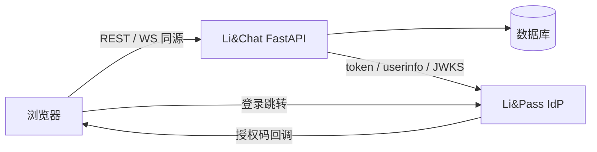

# Li&Chat 架构说明

## 总体结构

单进程 FastAPI 应用，同源托管前端，SQLite（起步）/ PostgreSQL（生产）持久化。浏览器只与 Li&Chat 通信，登录时短暂跳转 Li&Pass（OIDC IdP）。

## 模块职责

| 模块 | 职责 |
| --- | --- |
| `app/main.py` | 应用装配、生命周期（建表/建目录）、`/ws`、`/healthz`、静态挂载 |
| `app/config.py` | `LICHAT_*` 环境变量，生产环境校验会话密钥强度 |
| `app/db.py` | 异步引擎、`get_db` 依赖 |
| `app/models.py` | `users` / `auth_states` / `sessions` / `friendships` / `messages` / `dm_reads` / `reactions` / `message_mentions` / `user_stars` / `user_conversation_settings` / `groups` / `group_members` / `group_reads` / `uploads` / `call_logs` 十五张表 |
| `app/auth/` | 本地会话生命周期、Cookie、`get_current_user` / `require_csrf` |
| `app/oidc/` | 依赖方实现：发现文档、PKCE、授权状态、令牌校验、用户同步 |
| `app/sso/` | `/oidc/*` 路由、登出 state 签名、jti 防重放（内存/Redis 双实现） |
| `app/redis.py` | Redis 客户端构建与登出广播订阅（`LICHAT_REDIS_URL` 可选启用） |
| `app/ws/` | 内存连接表，按用户 sub 管理 WebSocket（连接级 session_id 跟踪）；presence/typing/call 信令中继；跨副本断开经 Redis 广播 |
| `app/api/` | `/api/me`、用户搜索、好友、单聊与群聊薄路由 |
| `app/friends/` | 好友业务：搜索、关系状态、申请生命周期 |
| `app/messages/` | 消息业务：发送、历史分页、长度/关系校验 |
| `app/groups/` | 群聊业务：建群、成员、角色与权限矩阵 |
| `app/uploads/` | 附件业务：内容嗅探、随机文件名、鉴权回源 |
| `app/search/` | 搜索业务：消息检索（可见范围 + 游标 + snippet）与联系人检索 |
| `static/` | 同源前端（登录、好友双栏、单聊、在线状态、退出） |
| `tests/fixtures/mock_idp.py` | 本地模拟 IdP，测试零外网依赖 |

## 数据模型

| 表 | 关键字段 | 说明 |
| --- | --- | --- |
| `users` | `sub`(PK)、nickname、name、picture、email、bio、last_seen_at | 门户 UUID 作主键，登录时 upsert；昵称/头像仅空值回填（本地编辑优先），bio 仅好友可见；last_seen_at 在 WS 连接与心跳时刷新 |
| `auth_states` | `state`(PK)、verifier、nonce、redirect_after、expires_at | 授权状态，单次使用 |
| `sessions` | `id`(PK)、user_sub、sid、acr、csrf_token、expires_at、absolute_expires_at | 绑定门户会话 `(sub, sid)`，支撑回程登出 |
| `friendships` | `requester_sub+addressee_sub`(复合 PK)、status、remark、reason、created_at、updated_at | 申请方向由 requester 表达；`pending`/`accepted`，无自环约束；remark 为本人视角备注名（≤32，仅自己可见）；reason 为申请附言（≤200，双方可见） |
| `messages` | `id`(自增，SQLite INTEGER/PostgreSQL BIGINT)、sender_sub、recipient_sub、participant_lo/hi、content、conversation_type(dm/group)、group_id、reply_to_id(自引用)、content_type(text/image/file/audio/poll)、poll_id、forwarded、attachment_*、edited_at、deleted_at、created_at | DM 用 `(participant_lo, participant_hi, id)` 索引；群消息按 `(group_id, id)` 索引，recipient/participant 以 `group:{id}` 哨兵占位兼容旧约束；撤回清空 content 留墓碑；引用预览不递归嵌套；转发复制内容并置 forwarded；poll 消息以 poll_id 关联投票，投票不可转发 |
| `dm_reads` | `user_sub+participant_lo+participant_hi`(复合 PK)、last_read_message_id、updated_at | 单聊已读游标，只前进；未读 = 对方消息 id 大于游标 |
| `reactions` | `message_id+user_sub+emoji`(复合 PK)、created_at | 幂等 toggle；聚合计数回显，不泄露非上榜用户 |
| `message_mentions` | `message_id+user_sub`(复合 PK) | @提及落账；发送时校验成员/对端 |
| `user_stars` | `user_sub+message_id`(复合 PK)、created_at | 收藏幂等 toggle；列表按 message_id 倒序游标 |
| `user_conversation_settings` | `user_sub+kind+key`(复合 PK)、pinned、muted、archived | 会话置顶/免打扰/归档；key：单聊 pair 排序键 / 群 id；归档会话从默认摘要隐藏（`?archived=true` 可见） |
| `call_logs` | `id`、caller_sub、callee_sub、kind、status、started_at、ended_at | 呼叫落账：missed/accepted/rejected |
| `groups` | `id`、name、owner_sub、announcement、avatar_url、created_at、updated_at | 群元数据；公告/头像由 owner/admin 维护，owner 变更随转让同步 |
| `group_members` | `group_id+user_sub`(复合 PK)、role(owner/admin/member)、muted、joined_at | 角色约束 + 权限矩阵在 service 层强校验；muted 由 owner/admin 维护，禁言成员发消息 403 |
| `group_reads` | `user_sub+group_id`(复合 PK)、last_read_message_id、updated_at | 群已读游标，只前进；未读 = 群消息 id 大于游标且非本人发送 |
| `polls` | `id`、group_id、creator_sub、question(≤120)、options(JSON ≤10 项各 ≤60)、multiple、closed、created_at | 群投票；选项以 JSON 落库；关闭后禁投；解散群级联清理 |
| `poll_votes` | `poll_id+user_sub`(复合 PK)、option_indexes(JSON)、updated_at | 每人一票（可含多选下标），投票即更新；聚合计数不回传他人选择明细 |
| `notifications` | `id`、user_sub、type、actor_sub、group_id、payload(JSON)、read_at、created_at | 站内通知：好友申请/@提及/禁言/角色变更/群解散；按用户倒序游标；payload 存展示所需快照（群名/消息 id/角色） |
| `uploads` | `id`、owner_sub、filename(唯一)、original_name、mime、size、created_at | 随机文件名防遍历；仅上传者可回源 |

## 关键链路

**登录**：`/oidc/login` 生成 state/nonce/PKCE 并跳转授权页 → 回调校验 state → 换码 → 校验 id_token（iss/aud=client_id/nonce/RS256/kid）→ userinfo → upsert 用户 → 建本地会话并种 Cookie。

**请求鉴权**：`get_current_user` 从 Cookie 取会话 id，滑动续期（2h），超绝对上限（7d）判失效。

**RP 登出**：删本地会话 → 带 HMAC 签名 state 跳 `end-session` → 门户回跳 `/oidc/post-logout` 验签回首页。

**回程登出**：门户 POST `logout_token` → 验 iss/aud/120 秒窗/jti/events → 清 `(sub, sid)` 会话并主动断开该用户 WS。

**实时通道**：`/ws` 握手校验同源 Cookie，无效以 4401 关闭；心跳 ping/pong；回程登出触发服务端断开。除心跳外，服务端按需推送 `message`（新消息：单聊双方 / 群全体）、`message_edited`/`message_deleted`（编辑/撤回：单聊双方 / 群全体）、`message_reaction`（回应增删：单聊双方 / 群全体）、`read_receipt`（已读回执：单聊会话另一方 / 群全体）、`presence`（好友上线/下线）、`group_event`（建群/成员/角色变更，群全体）、`call`（音视频呼叫信令，对端）与 `friend_event`（申请/接受/拒绝/解除，相关方）；客户端可发 `typing` 与 `call` 信令，服务端校验好友关系并限频后中继。
