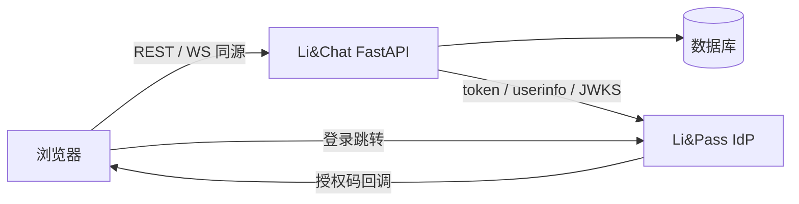

# Li&Chat 架构说明

## 总体结构

单进程 FastAPI 应用，同源托管前端，SQLite（起步）/ PostgreSQL（生产）持久化。浏览器只与 Li&Chat 通信，登录时短暂跳转 Li&Pass（OIDC IdP）。

## 模块职责

| 模块 | 职责 |
| --- | --- |
| `app/main.py` | 应用装配、生命周期（建表/建目录）、`/ws`、`/healthz`、静态挂载 |
| `app/config.py` | `LICHAT_*` 环境变量，生产环境校验会话密钥强度 |
| `app/db.py` | 异步引擎、`get_db` 依赖 |
| `app/models.py` | `users` / `auth_states` / `sessions` / `friendships` / `messages` 五张表 |
| `app/auth/` | 本地会话生命周期、Cookie、`get_current_user` / `require_csrf` |
| `app/oidc/` | 依赖方实现：发现文档、PKCE、授权状态、令牌校验、用户同步 |
| `app/sso/` | `/oidc/*` 路由、登出 state 签名、jti 防重放（内存/Redis 双实现） |
| `app/redis.py` | Redis 客户端构建与登出广播订阅（`LICHAT_REDIS_URL` 可选启用） |
| `app/ws/` | 内存连接表，按用户 sub 管理 WebSocket；跨副本断开经 Redis 广播 |
| `app/api/` | `/api/me`、用户搜索、好友与单聊薄路由 |
| `app/friends/` | 好友业务：搜索、关系状态、申请生命周期 |
| `app/messages/` | 消息业务：发送、历史分页、长度/关系校验 |
| `static/` | 同源前端（登录、好友双栏、单聊、在线状态、退出） |
| `tests/fixtures/mock_idp.py` | 本地模拟 IdP，测试零外网依赖 |

## 数据模型

| 表 | 关键字段 | 说明 |
| --- | --- | --- |
| `users` | `sub`(PK)、nickname、name、picture、email | 门户 UUID 作主键，登录时 upsert |
| `auth_states` | `state`(PK)、verifier、nonce、redirect_after、expires_at | 授权状态，单次使用 |
| `sessions` | `id`(PK)、user_sub、sid、acr、csrf_token、expires_at、absolute_expires_at | 绑定门户会话 `(sub, sid)`，支撑回程登出 |
| `friendships` | `requester_sub+addressee_sub`(复合 PK)、status、created_at、updated_at | 申请方向由 requester 表达；`pending`/`accepted`，无自环约束 |
| `messages` | `id`(自增，SQLite INTEGER/PostgreSQL BIGINT)、sender_sub、recipient_sub、participant_lo/hi、content、created_at | `(participant_lo, participant_hi, id)` 索引支撑会话历史 |

## 关键链路

**登录**：`/oidc/login` 生成 state/nonce/PKCE 并跳转授权页 → 回调校验 state → 换码 → 校验 id_token（iss/aud=client_id/nonce/RS256/kid）→ userinfo → upsert 用户 → 建本地会话并种 Cookie。

**请求鉴权**：`get_current_user` 从 Cookie 取会话 id，滑动续期（2h），超绝对上限（7d）判失效。

**RP 登出**：删本地会话 → 带 HMAC 签名 state 跳 `end-session` → 门户回跳 `/oidc/post-logout` 验签回首页。

**回程登出**：门户 POST `logout_token` → 验 iss/aud/120 秒窗/jti/events → 清 `(sub, sid)` 会话并主动断开该用户 WS。

**实时通道**：`/ws` 握手校验同源 Cookie，无效以 4401 关闭；心跳 ping/pong；回程登出触发服务端断开。除心跳外，服务端按需推送 `message`（新消息，双方）与 `friend_event`（申请/接受/拒绝/解除，相关方）。
