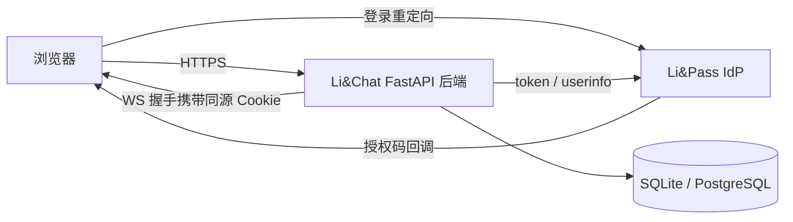

# Li&Chat SSO 接入基础方案（里程碑一）

- 状态：草稿，待评审
- 日期：2026-08-15
- 品牌：Li&Chat
- 身份提供方（IdP）：Li&Pass（OIDC/OAuth2，仅授权码 + PKCE S256）

## 1. 目标与范围

让 Li&Chat 的用户统一通过 Li&Pass 登录，本地**不存储任何密码**。本方案覆盖：

- 授权码登录闭环（authorize → callback → token → userinfo）
- 本地会话层（因 IdP 不提供刷新令牌，本地会话必须自建）
- 登出三路径：RP 发起登出、回程登出（back-channel logout）、降级策略
- 实时通道（WebSocket）的认证桥接

不包括：好友、单聊等 IM 功能（里程碑二，建立在本方案之上）。

## 2. 角色与总体架构

Li&Chat 后端是 OAuth2 的**依赖方（RP）**，Li&Pass 是 IdP。前端由 Li&Chat 后端同源托管，浏览器只与 Li&Chat 通信，登录时被短暂重定向到 Li&Pass。



## 3. 客户端注册与关键参数

| 参数 | 值/建议 | 说明 |
| --- | --- | --- |
| issuer | 发现文档声明 `http://account.lizf.cn`，传输层统一走 `https://account.lizf.cn` | `iss` 按发现文档原文校验，不自行改写（见 3.1） |
| 客户端类型 | 机密客户端 + PKCE S256（推荐） | secret 仅存服务端；还能使用自助黑名单 API |
| scope | `openid profile`（首版不含 `email`） | 避免"未验证邮箱用户"被挡在门外，昵称+头像足够聊天 |
| redirect_uri | 按环境配置，**精确匹配白名单** | dev 与 prod 各注册一条 |
| post_logout_redirect_uri | 按环境配置，精确匹配登出白名单 | RP 登出后回跳地址 |
| backchannel_logout_uri | 生产环境必须 https 且非回环/私网 | 本地开发不支持回程登出 |

### 3.1 实测发现文档（2026-08-15）

`https://account.lizf.cn/.well-known/openid-configuration` 实测返回：

```json
{
  "issuer": "http://account.lizf.cn",
  "authorization_endpoint": "http://account.lizf.cn/oauth2/authorize",
  "token_endpoint": "http://account.lizf.cn/oauth2/token",
  "userinfo_endpoint": "http://account.lizf.cn/oauth2/userinfo",
  "jwks_uri": "http://account.lizf.cn/oauth2/jwks",
  "response_types_supported": ["code"],
  "grant_types_supported": ["authorization_code"],
  "subject_types_supported": ["public"],
  "id_token_signing_alg_values_supported": ["RS256"],
  "scopes_supported": ["openid", "profile", "email"],
  "code_challenge_methods_supported": ["S256"],
  "end_session_endpoint": "http://account.lizf.cn/oauth2/end-session",
  "backchannel_logout_supported": true,
  "frontchannel_logout_supported": false
}
```

实测要点：

- TLS 由 openresty 终止，`http://` 请求返回 301 跳转到 `https://`，HTTPS 各端点均可用。
- 发现文档内所有 URL 均为 `http://` 字面值，与传输协议不一致——这是 IdP 侧配置问题，已列入风险（见第 15 节），建议 Li&Pass 团队将 issuer 改为 https。
- JWKS 当前同时发布两把 RS256 公钥：`lipass-rs256-1` 与 `portal-rs256-1`（品牌改名轮换期），必须按 token 头部 `kid` 动态选钥，不能缓存单钥。
- 结论：**传输一律用 `https://account.lizf.cn`，令牌校验用发现文档声明的 `iss` 原文（`http://account.lizf.cn`）**，发现文档启动时拉取并缓存（带 TTL），IdP 修正 issuer 后无需改代码。

## 4. 登录时序

1. 用户点"登录" → 后端生成 `state`（防 CSRF）、`nonce`（防重放）、PKCE `verifier/challenge`，跳转 `/oauth2/authorize`。
2. 用户在 Li&Pass 完成登录授权，回调 `/oidc/callback?code=...&state=...`。
3. 后端校验 `state` → 用 `code + code_verifier + client_secret` 换令牌。
4. 用 `access_token` 调 `/oauth2/userinfo` 取 `sub/nickname/picture`。
5. 校验 `id_token`：`iss` 等于 issuer、`aud` 等于自身 `client_id`、`nonce` 一致、RS256 验签、按 `kid` 从 JWKS 选钥。
6. 按 `sub` upsert 本地 `users` 表（同步昵称、头像），记录 `acr` 与门户会话 `sid`。
7. 创建本地会话（见第 5 节），种 HttpOnly Cookie，跳回首页。

**令牌寿命约束**：`access_token` 15 分钟、`id_token` 5 分钟、无刷新令牌——因此登录完成后不再依赖 IdP 令牌，本地会话是后续鉴权的唯一依据。

## 5. 本地会话设计

- Cookie：值 = 128 位随机 session id；属性 `HttpOnly + Secure(生产) + SameSite=Lax + Path=/`。
- `sessions` 表绑定 `(sub, sid)`：`sid` 是门户会话标识，用于回程登出精确定位。
- 有效期：滑动续期 2 小时，绝对上限 7 天；用户每次请求更新 `last_seen`。
- CSRF：`SameSite=Lax` 基础上，对非安全方法（POST/PUT/DELETE）校验 double-submit token。

## 6. 登出

**RP 发起登出**：清本地会话 → 302 到 `/oauth2/end-session?client_id=...&post_logout_redirect_uri=...&state=...`（优先用 `client_id`，不依赖 5 分钟即过期的 `id_token_hint`），回跳时校验 `state`。

**回程登出**：提供 `POST /oidc/backchannel-logout`，按指南校验：

- `iss` 等于 issuer、`aud` 等于自身 `client_id`、按 `kid` 验签
- `iat/exp` 在 120 秒新鲜窗口内
- `jti` 已见缓存防重放，同一 `jti` 只处理一次
- 仅当 `events` 含 `http://schemas.openid.net/event/backchannel-logout` 时生效
- 终止匹配 `(sub, sid)` 的本地会话，并主动断开该用户的 WebSocket

**本地开发降级**：无回程通道，靠 RP 登出 + 会话自然过期兜底；生产上线后切换为回程登出。

## 7. WebSocket 认证桥接

- 前端 WS 与后端同源，握手自动携带会话 Cookie；后端在 accept 前校验会话。
- 校验失败关闭连接，错误码 `4401`；前端收到后跳转登录。
- 会话被回程登出终止时，服务端主动关闭该用户的活跃连接。

## 8. 安全要求对照

| 指南要求 | 本方案落地 |
| --- | --- |
| 校验 state 与 nonce | 登录流程内置，不一致即中止 |
| 公开/机密客户端 PKCE | 机密客户端同样启用 S256，纵深防御 |
| redirect_uri 精确匹配 | 仅配置化读取，不拼接、不做前缀匹配 |
| 授权码单次、10 分钟 | token 交换失败即丢弃，重新发起 |
| id_token aud = client_id | 显式校验；access_token 仅用于调 userinfo，不按 client_id 校验 |
| JWKS 密钥轮换按 kid 选钥 | 依赖库动态拉取多公钥，不缓存单钥 |
| acr 声明 | 写入本地会话；强认证需求后续可按 `urn:lipass:acr:*` 拦截 |
| 账号被封禁 | `account_blocked` 映射为友好提示页 |

## 9. 错误处理矩阵

| 场景 | 处理 |
| --- | --- |
| `access_denied` / `account_blocked` | 登录页提示"访问被拒绝或账号受限"，不泄露细节 |
| `invalid_grant`（码过期/重放/PKCE 失败） | 丢弃会话状态，引导重新发起授权 |
| 回调缺 `code`、`state` 不匹配 | 400 终止，记录审计日志 |
| userinfo 缺少必要 claims | 提示"用户信息暂不可用"，重新登录 |
| 邮箱未验证跳转（若启用 email scope） | 视为登录未完成，提示先完成邮箱验证 |
| IdP 网络超时 | 登录接口 10 秒超时，返回可重试错误 |

## 10. 技术选型

- `pyjwt[crypto]`：`PyJWKClient` 负责 JWKS 拉取、按 `kid` 选钥与密钥轮换
- `httpx`：OAuth2 授权码交换、userinfo 调用与发现文档拉取（异步）
- `sqlalchemy + aiosqlite`（起步）/ PostgreSQL（生产）+ `alembic` 迁移
- `pydantic-settings` 配置、`structlog` 结构化日志
- 工具链：`uv` + Python 3.12，`pytest`、`ruff`、`mypy`

> 相对初稿的调整：去掉 authlib，改用 pyjwt + httpx 显式实现校验步骤。安全校验（state/nonce/iss/aud/时间窗）是我们自己必须逐项确认的核心逻辑，显式写出来更利于学习和审计；JWKS 的 kid 选钥与轮换由 PyJWKClient 成熟实现承载。

## 11. SSO 相关目录结构

```
li-chat/
├── app/
│   ├── config.py            # OIDC_ISSUER / CLIENT_ID / 白名单等
│   ├── db.py                # 引擎与会话
│   ├── models.py            # users / sessions
│   └── sso/
│       ├── oidc.py          # authlib 客户端 + 发现文档
│       ├── routes.py        # /login /callback /logout /backchannel-logout
│       ├── session.py       # 本地会话读写与 CSRF
│       ├── tokens.py        # id_token / logout_token 校验
│       └── user_sync.py     # userinfo → 本地用户 upsert
├── static/                  # 同源前端
├── tests/
└── pyproject.toml
```

## 12. 里程碑与验收标准

| 里程碑 | 交付物 | 验收标准 |
| --- | --- | --- |
| M0 客户端注册 | 环境变量就绪 | 能从发现文档读到全部端点 |
| M1 登录闭环 | 授权码 + PKCE 全流程 | 真实账号能登录并显示昵称头像 |
| M2 本地会话 | 会话中间件 + 受保护路由 + 前端 | 未登录访问受限；刷新页面保持登录 |
| M3 RP 登出 | 登出路由 | 本地会话清除且正确回跳 |
| M4 回程登出 | backchannel 端点 | 门户登出后本地会话与 WS 立即失效；jti 防重放 |
| M5 WS 桥接 | 连接校验 | 无会话连接被 4401 拒绝；登出主动断开 |
| M6 安全自查 | 对照表逐项验证 + 测试 | pytest 全绿，ruff/mypy 无告警 |

## 13. 待提供 / 待确认项

| 项 | 需要 |
| --- | --- |
| issuer URL | ✅ 已提供：`https://account.lizf.cn`（注意 3.1 的 http/https 声明差异） |
| client_id / client_secret | 在 Li&Pass 授权网站管理创建并配置后提供 |
| redirect_uri | 本地开发用的完整回调地址（域名+端口） |
| 登出回跳白名单 | 本地与生产各一条 |
| 回程登出地址 | 生产域名（https） |
| scope 策略 | 确认首版 `openid profile`（不强制邮箱）是否可接受 |
| 会话有效期 | 滑动 2h / 绝对 7d 是否符合预期 |

## 14. 与后续里程碑的衔接

好友与单聊直接以 `users.sub`（门户 UUID）作为用户主键，全程无本地密码字段。后续任何需要强认证的能力（如敏感设置）可基于会话中记录的 `acr` 值做二次校验。

## 15. 风险与开放问题

| 风险 | 影响 | 处置 |
| --- | --- | --- |
| 发现文档 issuer 为 http 字面值 | 严格按 OIDC 校验 `iss` 时必须照原文比对，若 IdP 侧修正为 https，旧缓存可能短暂不匹配 | 本方案以发现文档为准；建议推动 IdP 修正，我方用短 TTL 缓存降低影响 |
| 授权码 10 分钟、令牌无刷新 | 登录态只能靠本地会话维持 | 本地会话滑动 2h/绝对 7d 兜底，过期即重新走授权 |
| 回程登出仅生产可用 | 本地开发期间门户登出无法即时同步 | 开发环境降级为会话过期兜底，生产必须配置回程地址 |
